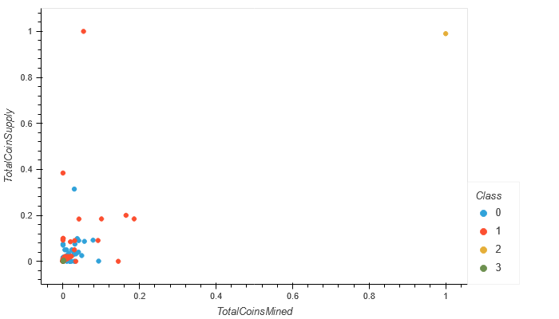

# Cryptocurrencies_Analysis

## Purpose:
#### Accountability Accounting, a prominent investment bank, wants to start offering crypto portfolios to their customers. Martha, senior manager for the Advisory Services Team at Accountability Accounting, has tasked us to create a report that showcases all the crypto currencies currently on the market. The goal is to find patterns with unsupervised learning clustering algorithms and then to classify the data. The findings will be presented via data visualization.

 

## Results:
As can be seen in the graph below, we were able to cluster all cryptocurrencies that were being traded based on the supply vs coins mined. The outliers being BitTorrent(top-right) and TurtleCoin(top-left).

